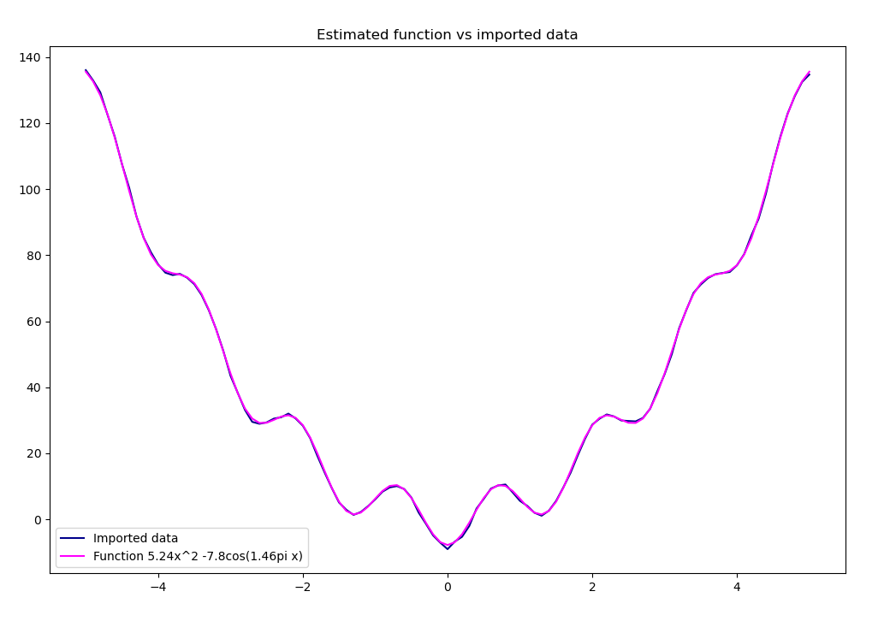
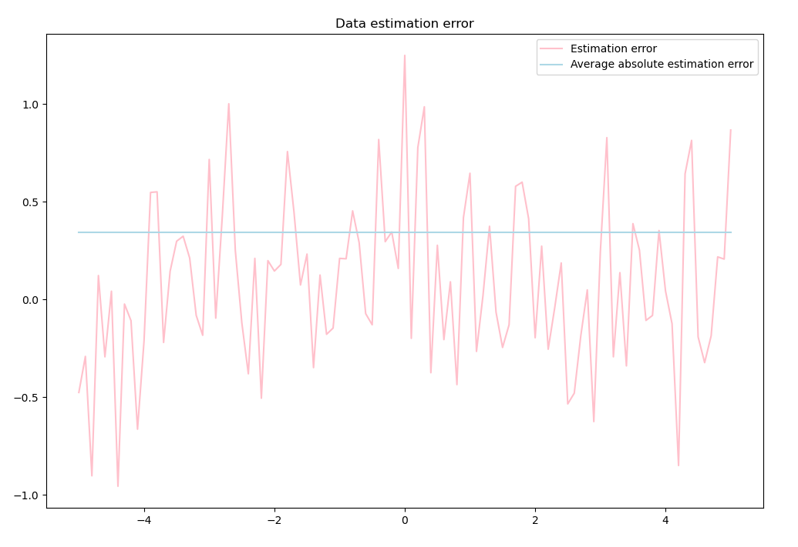

# The problem
Given a function of form

y(x) = <i>a</i>x2 + <i>b</i>cos(<i>c</i>&pi;<i>x</i>)

and a set of (_x_, _y_) pairs, find the coefficients _a_, _b_ and _c_, so that the function _y_ closely approximates the input data within set error margin.

# The evolution strategy solution

To create the population, we need a random set of candidates and mutation factors. The initial guesses are selected from a potentially good interval, i.e. normal distribution with _&sigma; = 5_ bound between _-10_ and _10_. While the wanted parameters evolve with the help of mutation factors, the mutation factors themselves are log-normal with coefficients &tau;1 and &tau;2.

In every iteration of the algorithm an offspring population is generated from parents thorough mutation. The two groups are then combined and their fit to the input data is assessed. Only the best candidates are selected from this set and this is considered the parents population in the next iteration. The loop finishes when the difference between the best parent and the best offspring is smaller than given accuracy &epsilon;. Finally, the parameters are acquired from the best candidate in the final population and the resulting function is plotted against the input data. Additionally, the differences between the real and estimated values are shown on a graph.

